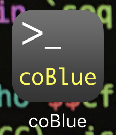
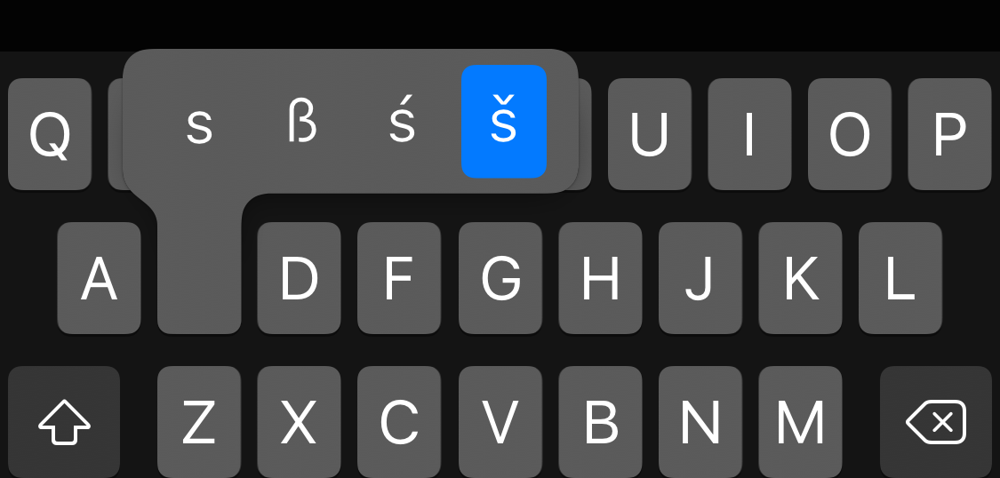

# coBlue - iOS App
Its an iOS application is used to interact with [coBlue](https://github.com/cocoahuke/coBlue), [coblue-control](https://github.com/cocoahuke/coblue-control) is the similar control program running on Macos  
See [coBlue](https://github.com/cocoahuke/coBlue) for details

   

## How to use
>**Download** it in the [release](https://github.com/cocoahuke/coBlue-iOS/releases/tag/1.0) page  

>Use the [Impactor](http://www.cydiaimpactor.com/) to **install** the ipa as application on your iPhone. Impactor &nbsp; is a super nice tool for signing Ipa files, and the author is [saurik](https://twitter.com/saurik?lang=en)

&nbsp;
>**Open** the app then, the icon of the app looks like this
  

>The first time you open the App need to set up device Name & verify Key, Enter `š` to open the setting view  

&nbsp;
>**Set Device name**, Device name is the name of the [coBlue](https://github.com/cocoahuke/coBlue) BLE Peripherals which listed when scanning, default name is orange, you can specify by `-name` in [coBlue](https://github.com/cocoahuke/coBlue)  

&nbsp;
>**Set verify key**, it will send verify key immediately after the connection establish, set key by `-verifyw` in [coBlue](https://github.com/cocoahuke/coBlue)  

&nbsp;
>After all set done, Tap `Apply` and restart the app, those setting will be saved

##if you want compile your own
I was build on Xcode6.2, so there may be some problems in the newer version of Xcode
tested in iOS10.2
recommand just downloaded in the [release](https://github.com/cocoahuke/coBlue-iOS/releases/tag/1.0) page

## Demo

